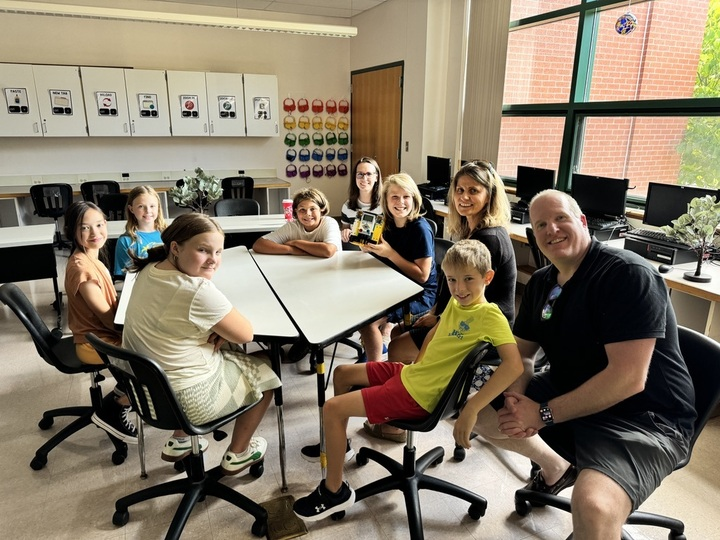
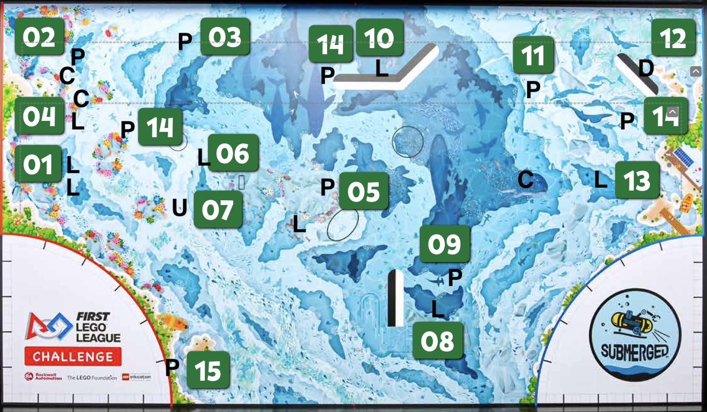

# Team 19991 Robotics - Submerged 2024

## First Game Rules, Judging, and other Information
[2024 Submerged Robot Game Rule](https://firstinspires.blob.core.windows.net/fll/challenge/2024-25/fll-challenge-submerged-rgr-eng.pdf)

[2024 Submerged Challenge Updates](https://firstinspires.blob.core.windows.net/fll/challenge/2024-25/fll-challenge-updates-and-clarifications.pdf)

[2024 Submerged Robot Game Scoring Tool](https://eventhub.firstinspires.org/scoresheet)

[2024 Submerged Judging Rubric](https://firstinspires.blob.core.windows.net/fll/challenge/2024-25/fll-challenge-submerged-rubrics-color.pdf)

[2024 Submerged Mission Model Build Instructions](https://www.firstlegoleague.org/season?__hstc=212927755.dbef977658b50c7f632f87d695f2bbe3.1722951784801.1723652535897.1724766434780.5&__hssc=212927755.1.1724766434780&__hsfp=3531153208)

[2024 Submerged Field Setup Guide](https://docs.google.com/presentation/d/1tI0MJXJH19z141av1CC6lwUby5iERwdhnWmgEx6pxns/edit?pli=1#slide=id.g2f5cf425f3e_0_455)

[2024 Submerged Map Planning Tool](https://flltools.flltutorials.com/drawplan)

## Task Tracking and Planning
[Robot Project Info](https://docs.google.com/document/d/1ubIg5bTiTGuGmL1Dgg-yhrOHEVOF6r5qDaiEzJN3C5M/)

[Mission Planning](https://docs.google.com/spreadsheets/d/13WemKwUhrlFnUh6gTCBOrBsw_2ghDaJ3/edit?invite=CIKViuQL&exids=71471469%2C71471463&gid=1650685608#gid=1650685608)

[Mission Collection and Scoring](https://docs.google.com/presentation/d/1m4cjALjJmmSsDaClf5pEo_zFIQaSzg9kTJxfkuqVSlU/edit?exids=71471469,71471463#slide=id.g3059f7b9f73_0_139)

[Team 19991's 2024 Robot Code](https://github.com/jth214/fll-19991-fall-2024)

[Data Collection excel file](https://github.com/fll-19991/fll-19991.github.io/blob/main/measurements.xlsx)

## Meeting Slides & Notes
2024-09-25 Introduction to Python and the EV3 Bot [pdf](https://github.com/fll-19991/fll-19991.github.io/blob/main/Intro%20to%20Python.pdf) [keynote](https://github.com/fll-19991/fll-19991.github.io/blob/main/Intro%20to%20Python.key)

## Reference Information
[Bolton Robotics Spring Training Website](https://fssfll.github.io/fssfll/)

[Pybrics Documentation](https://pybricks.com/ev3-micropython/index.html)

## Team 18300's Basebot Build Instructions
<a class="buildin3d-instructions" href="https://platform.buildin3d.com/instructions/987-team-18300-s-fll-basebot" width="710" height="590">Team 18300's FLL Basebot</a>
